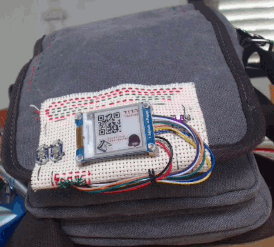
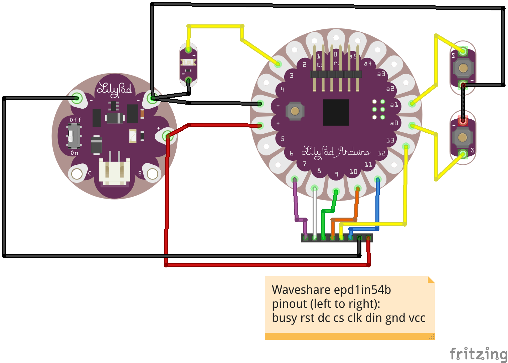
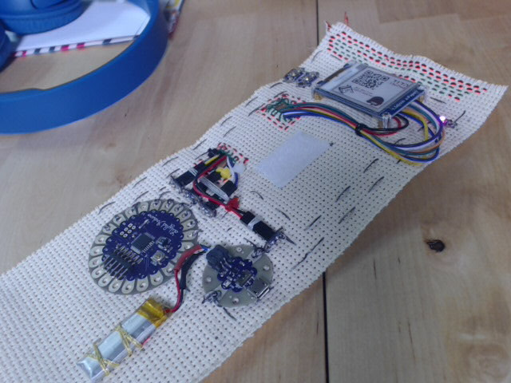
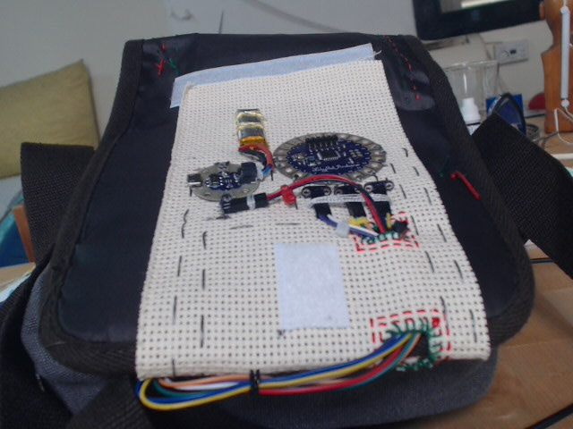

# GDEW0154Z04 1.54" dual-color e-paper library for Arduino (with RLE support)
GDEW0154Z04 1.54" dual-color e-paper library for Arduino

This is a fork of the original Waveshare library, where I've added RLE decompression support for the *epd1in4b* model, in order to enable storing 9 bitmaps (4 black/white/red images + a b/w one) inside the `PROGMEM` of an *Arduino Lilypad*for the *Multiznachok (мультизначок)* project.

**Thanks to [sister](http://coensisters.org) @[tamaroty](https://github.com/tamaroty) for stitching and design ideas ❣**



## Installation
From the Arduino IDE's menu, select `Sketch` `Include Library` `Add .ZIP Library...`, and add the file `1.54inch_e-paper_b/epd1in54b.zip`.

## Image Conversion

* Save each bitmap (black and red, or only one of them) as a 200x200 pixel [ASCII pbm](https://en.wikipedia.org/wiki/Netpbm_format#PBM_example) file (for example, you can do that with [gimp](https://www.gimp.org/)).
* `python pbm2rle.py < MY_IMAGE.pbm > rle_my_image.cpp`.
* Edit `rle_my_image.cpp` and change `BITMAP_NAME_GOES_HERE` to `my_image`.
* In your `.ino` code, you can now do

  ```
  #include <epd1in54bRLE.h>
  Epd epd;
  // ...
  epd.DisplayRLE(my_image, NULL); // B/W
  // or
  epd.DisplayRLE(my_image_black, my_image_red); // Black/White/red

  ``` 

## EXAMPLE

### Software
From the Arduino IDE's menu, select `File` `Examples` `epd1in54bRLE` `multiznachok`.

### Hardware



**See also:** the [epd1in4b-demo/fritzing/](libraries/examples/multiznachok/fritzing) folder.

You can sew it on a strip of tapestry cloth...


...and attach it to a bag with [Hook and loop](https://en.wikipedia.org/wiki/Hook_and_loop_fastener) strips.


Enjoy.
